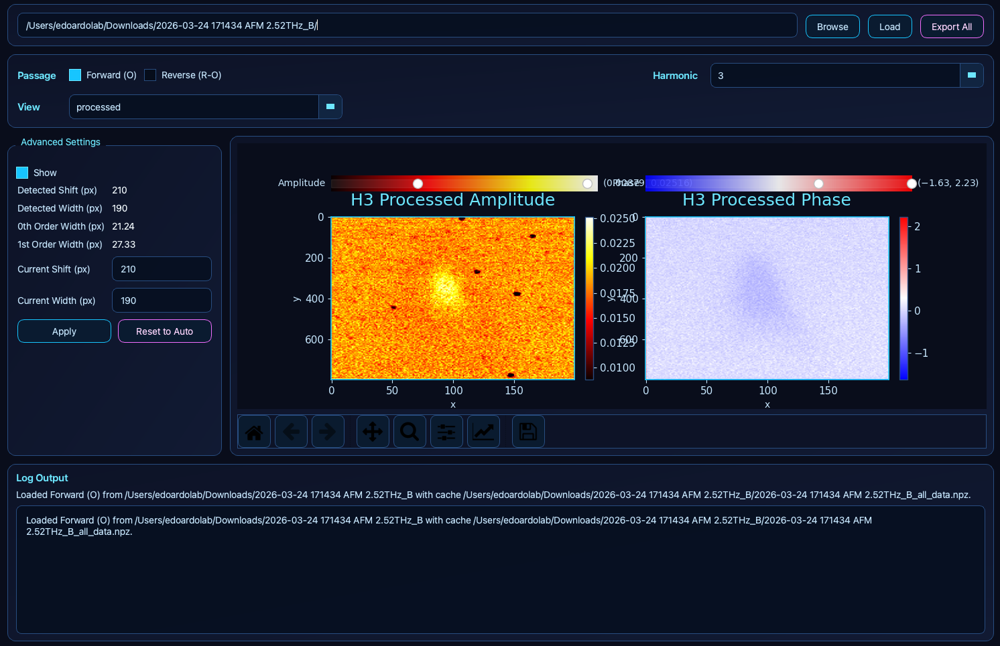

# Synthetic_holography_preview

Desktop preview tool for synthetic holography and SNOM hologram inspection.

This project loads a folder of `.gsf` files, reconstructs the holographic signal, and provides an interactive PySide6 viewer for checking harmonics, intermediate Fourier-domain stages, and manual filtering parameters before export.



## Features

- PySide6 desktop GUI with embedded Matplotlib viewer
- Forward / reverse passage selection
- Harmonic selection for `1..5`
- Stage selection for:
  - `raw`
  - `processed`
  - `mag_signal_ft`
  - `filtered_shift`
- Side-by-side amplitude and phase visualization
- Per-plot range sliders for live color scaling
- Advanced diagnostics panel with:
  - detected shift
  - detected filter width
  - measured 0th-order width
  - measured 1st-order width
  - manual shift / width override
- Batch export for raw / processed PNG outputs

## Requirements

- Python 3.10+
- `pip`

Install dependencies:

```bash
python3 -m pip install -r requirements.txt
```

If your Python installation is PEP 668 managed on macOS/Linux, you may need:

```bash
python3 -m pip install --user --break-system-packages -r requirements.txt
```

## Run

```bash
python3 main.py
python3 main.py "/path/to/data/folder"
```

## Expected Data Layout

The app expects a folder containing SNOM `.gsf` files named with the existing project convention, for example:

- `<image_name> Z raw.gsf`
- `<image_name> O1A raw.gsf`
- `<image_name> O1P raw.gsf`
- `<image_name> R-O1A raw.gsf`
- `<image_name> R-O1P raw.gsf`

Amplitude / phase harmonic pairs are combined internally into complex-valued harmonic stacks.

## Reconstruction Workflow

1. Load raw `.gsf` files or a cached `.npz` bundle.
2. Build complex harmonic stacks from amplitude and phase.
3. Detect the vertical first-order sideband in shifted Fourier space.
4. Estimate a vertical filter width.
5. Isolate the sideband, shift it to the Fourier center, and inverse transform.
6. Preview amplitude, phase, and intermediate stages in the GUI.

## Exported Files

`Export All` writes the existing raw / processed PNG set only.

For each harmonic `1..5`, the app exports:

- `h{n}_raw_amplitude.png`
- `h{n}_raw_phase.png`
- `h{n}_processed_amplitude.png`
- `h{n}_processed_phase.png`

## Project Structure

```text
main.py
viewer.py
processing.py
requirements.txt
GUI.png
```

- `main.py`: application entry point
- `viewer.py`: PySide6 GUI and Matplotlib integration
- `processing.py`: hologram loading, reconstruction, diagnostics, and export logic

## Packaging

Install PyInstaller:

```bash
python3 -m pip install pyinstaller
```

Build:

```bash
pyinstaller --noconfirm --windowed --name synthetic_holography_preview main.py
```

The packaged app will be created under `dist/`.

## Publishing Notes

Before making the repository public, review:

- repository description and topics
- screenshot accuracy in `GUI.png`
- dependency install instructions for your target platform
- license choice

A lightweight publication checklist is included in [CONTRIBUTING.md](./CONTRIBUTING.md).
